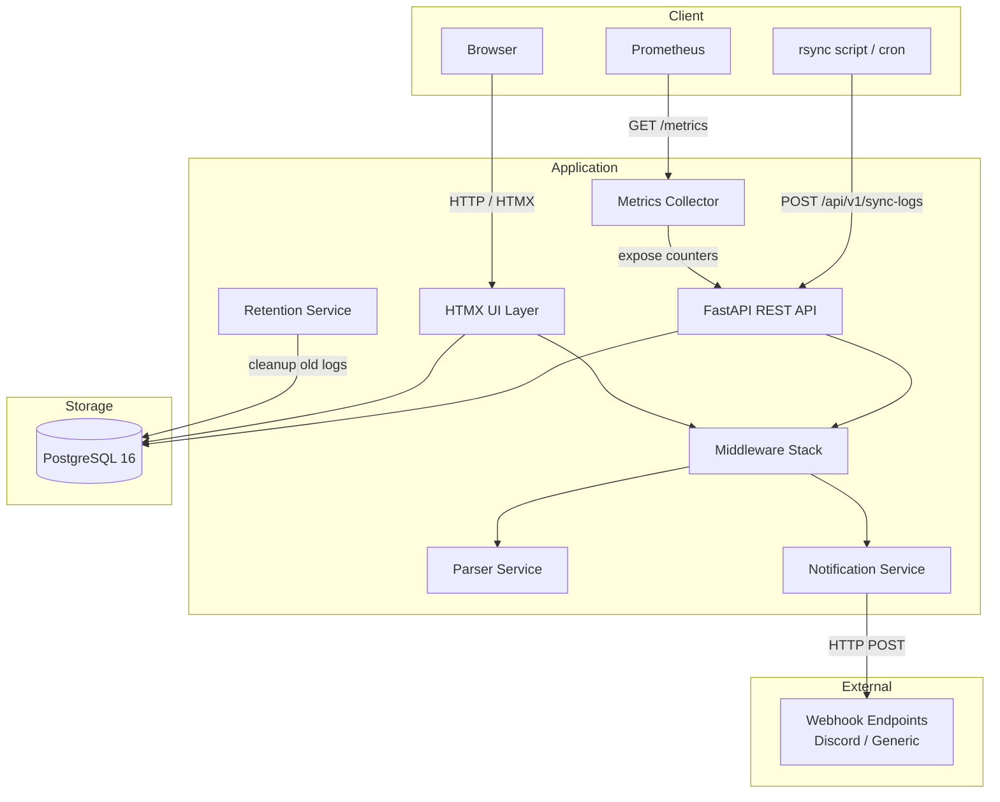

# Architecture

## System Overview

Rsync Log Viewer is a web application for collecting, parsing, and visualizing rsync synchronization logs. It is designed for homelab and self-hosted deployment using Docker Compose.

## Key Components

### FastAPI Application (`app/main.py`)

The main application entry point. Registers middleware, routers, exception handlers, and the HTMX template engine. Serves both the REST API and the web dashboard.

### Middleware Stack (`app/middleware.py`, `app/metrics.py`)

Middleware runs in this order (outermost first):

1. **SecurityHeadersMiddleware** — Adds X-Content-Type-Options, X-Frame-Options, CSP headers
2. **BodySizeLimitMiddleware** — Rejects requests exceeding `MAX_REQUEST_BODY_SIZE`
3. **PrometheusMiddleware** — Tracks API request counts and durations
4. **SlowAPIMiddleware** — Enforces rate limiting per API key or IP
5. **CsrfMiddleware** — Validates CSRF tokens on form submissions
6. **RequestLoggingMiddleware** — Structured JSON logging with request IDs

### REST API (`app/api/endpoints/`)

- **sync_logs** — CRUD for rsync log ingestion and querying
- **monitors** — Sync source monitoring (staleness detection)
- **failures** — Failure event tracking and queries
- **webhooks** — Webhook endpoint management
- **analytics** — Aggregated statistics and trends

### Parser Service (`app/services/rsync_parser.py`)

Parses raw rsync output to extract structured data: bytes transferred, file counts, transfer speed, speedup ratio, file lists, and dry-run detection.

### Notification Service (`app/services/notification.py`)

Sends webhook notifications when failure events occur. Supports generic JSON webhooks and Discord-formatted embeds with retry logic.

### Retention Service (`app/services/retention.py`)

Background task that periodically cleans up sync logs older than `DATA_RETENTION_DAYS`. Deletes in FK cascade order: notification_logs → failure_events → sync_logs.

### Metrics Collector (`app/metrics.py`)

Prometheus metrics using a custom `CollectorRegistry`:
- **Sync metrics:** totals, duration histogram, files/bytes counters (per source)
- **API metrics:** request totals and duration histogram (per endpoint/method)
- **Health metrics:** application version info gauge

### Database (`app/database.py`)

SQLModel ORM with PostgreSQL 16. Connection pooling configured via `DB_POOL_SIZE`, `DB_MAX_OVERFLOW`, and `DB_POOL_TIMEOUT`.

### Frontend (`app/templates/`)

Server-side rendered HTML using Jinja2 templates with HTMX for dynamic updates. No JavaScript build step required.

## Data Flow

### Sync Log Submission

1. An rsync script or cron job sends a POST request to `/api/v1/sync-logs` with the raw rsync output
2. The API validates the request and authenticates via the `X-API-Key` header
3. The rsync parser extracts structured fields from the raw content
4. The parsed sync log is stored in PostgreSQL
5. Prometheus sync metrics are updated (totals, duration, files, bytes)
6. If the sync failed (non-zero exit code), a failure event is created
7. Active webhook endpoints matching the source are notified

### Dashboard Viewing

1. The browser requests the main page (`/`)
2. FastAPI renders the Jinja2 template with HTMX attributes
3. HTMX fetches table data, charts, and analytics via partial endpoints (`/htmx/*`)
4. Filters and pagination update dynamically without full page reloads

### Metrics Scraping

1. Prometheus scrapes `GET /metrics` at a configured interval
2. The endpoint returns all counters, histograms, and gauges in Prometheus exposition format
3. Grafana dashboards visualize the scraped metrics

## Deployment

The application is containerized with Docker Compose:

| Service | Image | Port | Purpose |
|---------|-------|------|---------|
| `app` | Local build | 8000 | FastAPI application |
| `db` | postgres:16-alpine | 5432 | PostgreSQL database |

Database state is persisted in a Docker volume (`postgres_data`). See [Setup Guide](setup.md) for deployment instructions.
