# Sequence Diagrams

Request flow diagrams for the Rsync Log Viewer application.

## Sync Log Ingestion (POST /api/v1/sync-logs)

The primary data ingestion flow — rsync scripts POST raw output for parsing and storage.

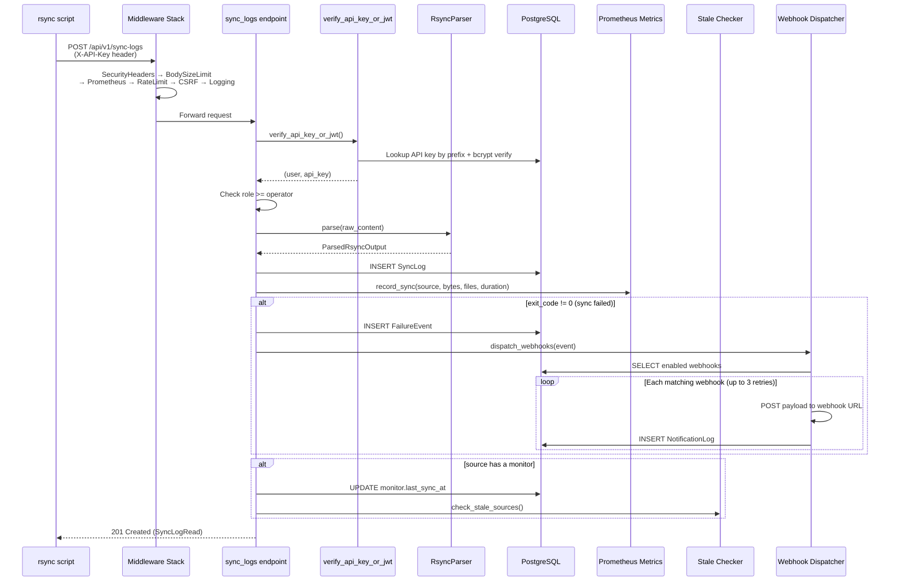
```mermaid
sequenceDiagram
    participant C as rsync script
    participant MW as Middleware Stack
    participant API as sync_logs endpoint
    participant Auth as verify_api_key_or_jwt
    participant P as RsyncParser
    participant DB as PostgreSQL
    participant M as Prometheus Metrics
    participant SC as Stale Checker
    participant WH as Webhook Dispatcher

    C->>MW: POST /api/v1/sync-logs<br/>(X-API-Key header)
    MW->>MW: SecurityHeaders → BodySizeLimit<br/>→ Prometheus → RateLimit → CSRF → Logging
    MW->>API: Forward request
    API->>Auth: verify_api_key_or_jwt()
    Auth->>DB: Lookup API key by prefix + bcrypt verify
    Auth-->>API: (user, api_key)
    API->>API: Check role >= operator
    API->>P: parse(raw_content)
    P-->>API: ParsedRsyncOutput
    API->>DB: INSERT SyncLog
    API->>M: record_sync(source, bytes, files, duration)

    alt exit_code != 0 (sync failed)
        API->>DB: INSERT FailureEvent
        API->>WH: dispatch_webhooks(event)
        WH->>DB: SELECT enabled webhooks
        loop Each matching webhook (up to 3 retries)
            WH->>WH: POST payload to webhook URL
            WH->>DB: INSERT NotificationLog
        end
    end

    alt source has a monitor
        API->>DB: UPDATE monitor.last_sync_at
        API->>SC: check_stale_sources()
    end

    API-->>C: 201 Created (SyncLogRead)
```

## Sync Log Querying (GET /api/v1/sync-logs)

Paginated log listing with cursor-based and offset pagination.

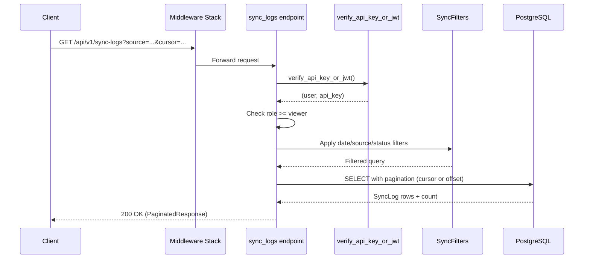
```mermaid
sequenceDiagram
    participant C as Client
    participant MW as Middleware Stack
    participant API as sync_logs endpoint
    participant Auth as verify_api_key_or_jwt
    participant F as SyncFilters
    participant DB as PostgreSQL

    C->>MW: GET /api/v1/sync-logs?source=...&cursor=...
    MW->>API: Forward request
    API->>Auth: verify_api_key_or_jwt()
    Auth-->>API: (user, api_key)
    API->>API: Check role >= viewer
    API->>F: Apply date/source/status filters
    F-->>API: Filtered query
    API->>DB: SELECT with pagination (cursor or offset)
    DB-->>API: SyncLog rows + count
    API-->>C: 200 OK (PaginatedResponse)
```

## Dashboard Page Load (GET /)

Browser requests the main dashboard, then HTMX fetches dynamic partials.

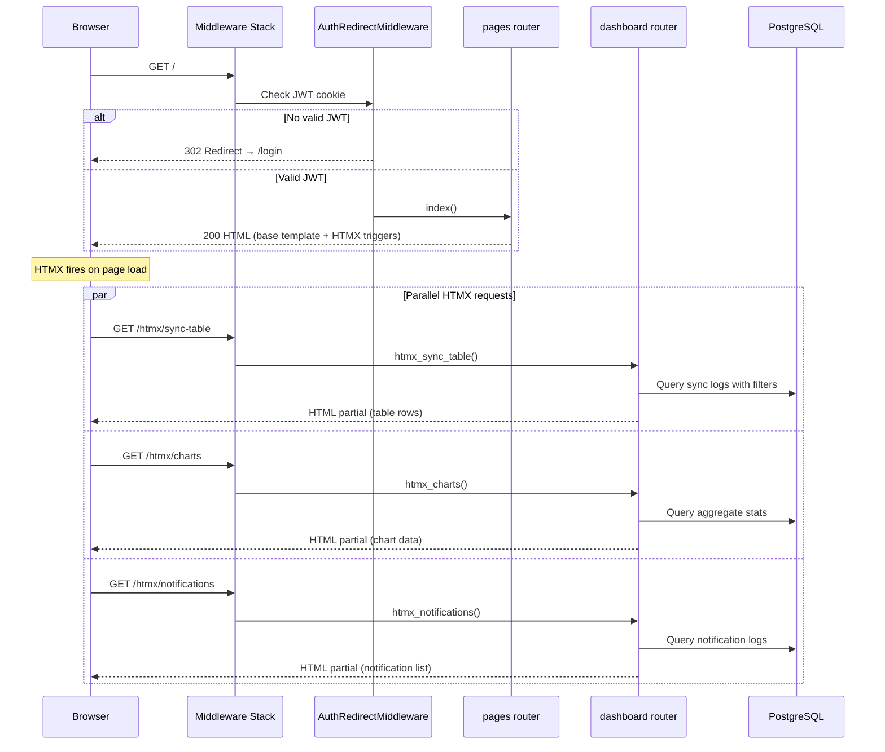
```mermaid
sequenceDiagram
    participant BR as Browser
    participant MW as Middleware Stack
    participant Auth as AuthRedirectMiddleware
    participant Pages as pages router
    participant HTMX as dashboard router
    participant DB as PostgreSQL

    BR->>MW: GET /
    MW->>Auth: Check JWT cookie
    alt No valid JWT
        Auth-->>BR: 302 Redirect → /login
    else Valid JWT
        Auth->>Pages: index()
        Pages-->>BR: 200 HTML (base template + HTMX triggers)
    end

    Note over BR: HTMX fires on page load

    par Parallel HTMX requests
        BR->>MW: GET /htmx/sync-table
        MW->>HTMX: htmx_sync_table()
        HTMX->>DB: Query sync logs with filters
        HTMX-->>BR: HTML partial (table rows)
    and
        BR->>MW: GET /htmx/charts
        MW->>HTMX: htmx_charts()
        HTMX->>DB: Query aggregate stats
        HTMX-->>BR: HTML partial (chart data)
    and
        BR->>MW: GET /htmx/notifications
        MW->>HTMX: htmx_notifications()
        HTMX->>DB: Query notification logs
        HTMX-->>BR: HTML partial (notification list)
    end
```

## Authentication Flow (Login)

Browser-based login via form submission, setting JWT cookies.

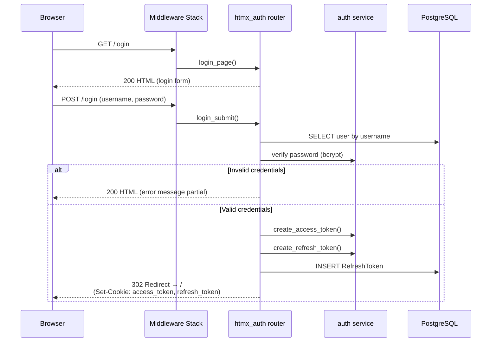
```mermaid
sequenceDiagram
    participant BR as Browser
    participant MW as Middleware Stack
    participant UI as htmx_auth router
    participant AuthSvc as auth service
    participant DB as PostgreSQL

    BR->>MW: GET /login
    MW->>UI: login_page()
    UI-->>BR: 200 HTML (login form)

    BR->>MW: POST /login (username, password)
    MW->>UI: login_submit()
    UI->>DB: SELECT user by username
    UI->>AuthSvc: verify password (bcrypt)

    alt Invalid credentials
        UI-->>BR: 200 HTML (error message partial)
    else Valid credentials
        UI->>AuthSvc: create_access_token()
        UI->>AuthSvc: create_refresh_token()
        UI->>DB: INSERT RefreshToken
        UI-->>BR: 302 Redirect → /<br/>(Set-Cookie: access_token, refresh_token)
    end
```

## OIDC Authentication Flow

SSO login via OpenID Connect provider.

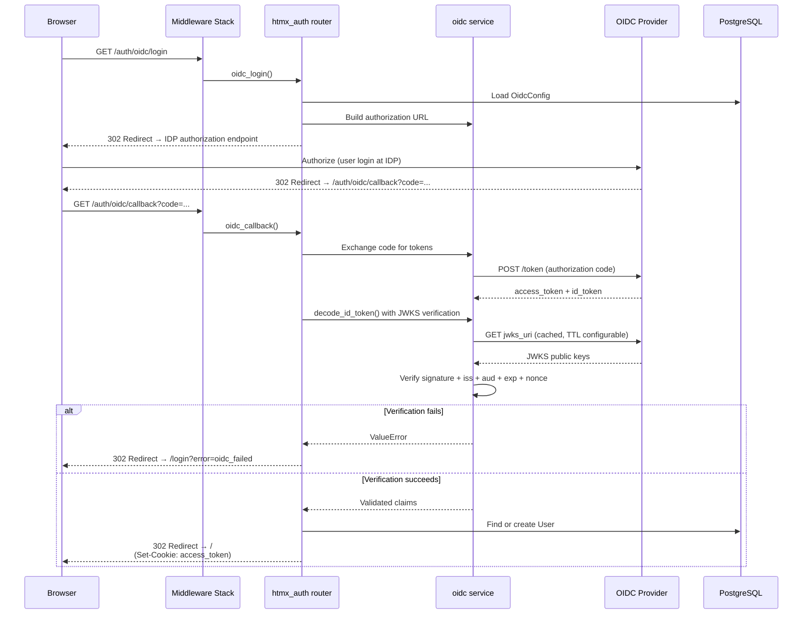
```mermaid
sequenceDiagram
    participant BR as Browser
    participant MW as Middleware Stack
    participant UI as htmx_auth router
    participant OIDC as oidc service
    participant IDP as OIDC Provider
    participant DB as PostgreSQL

    BR->>MW: GET /auth/oidc/login
    MW->>UI: oidc_login()
    UI->>DB: Load OidcConfig
    UI->>OIDC: Build authorization URL
    UI-->>BR: 302 Redirect → IDP authorization endpoint

    BR->>IDP: Authorize (user login at IDP)
    IDP-->>BR: 302 Redirect → /auth/oidc/callback?code=...

    BR->>MW: GET /auth/oidc/callback?code=...
    MW->>UI: oidc_callback()
    UI->>OIDC: Exchange code for tokens
    OIDC->>IDP: POST /token (authorization code)
    IDP-->>OIDC: access_token + id_token
    UI->>OIDC: decode_id_token() with JWKS verification
    OIDC->>IDP: GET jwks_uri (cached, TTL configurable)
    IDP-->>OIDC: JWKS public keys
    OIDC->>OIDC: Verify signature + iss + aud + exp + nonce
    alt Verification fails
        OIDC-->>UI: ValueError
        UI-->>BR: 302 Redirect → /login?error=oidc_failed
    else Verification succeeds
        OIDC-->>UI: Validated claims
        UI->>DB: Find or create User
        UI-->>BR: 302 Redirect → /<br/>(Set-Cookie: access_token)
    end
```

## API Key Management (HTMX)

Creating and revoking API keys via the settings UI.

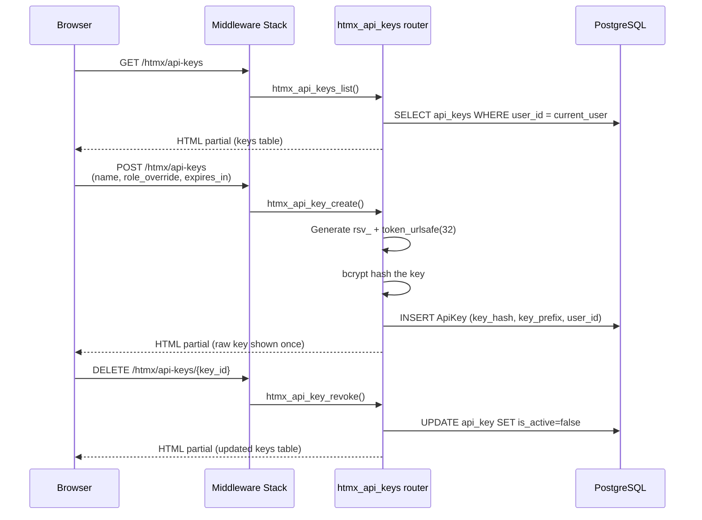
```mermaid
sequenceDiagram
    participant BR as Browser
    participant MW as Middleware Stack
    participant UI as htmx_api_keys router
    participant DB as PostgreSQL

    BR->>MW: GET /htmx/api-keys
    MW->>UI: htmx_api_keys_list()
    UI->>DB: SELECT api_keys WHERE user_id = current_user
    UI-->>BR: HTML partial (keys table)

    BR->>MW: POST /htmx/api-keys<br/>(name, role_override, expires_in)
    MW->>UI: htmx_api_key_create()
    UI->>UI: Generate rsv_ + token_urlsafe(32)
    UI->>UI: bcrypt hash the key
    UI->>DB: INSERT ApiKey (key_hash, key_prefix, user_id)
    UI-->>BR: HTML partial (raw key shown once)

    BR->>MW: DELETE /htmx/api-keys/{key_id}
    MW->>UI: htmx_api_key_revoke()
    UI->>DB: UPDATE api_key SET is_active=false
    UI-->>BR: HTML partial (updated keys table)
```

## Webhook Dispatch Flow

When a failure event occurs, notifications are dispatched to configured webhooks.

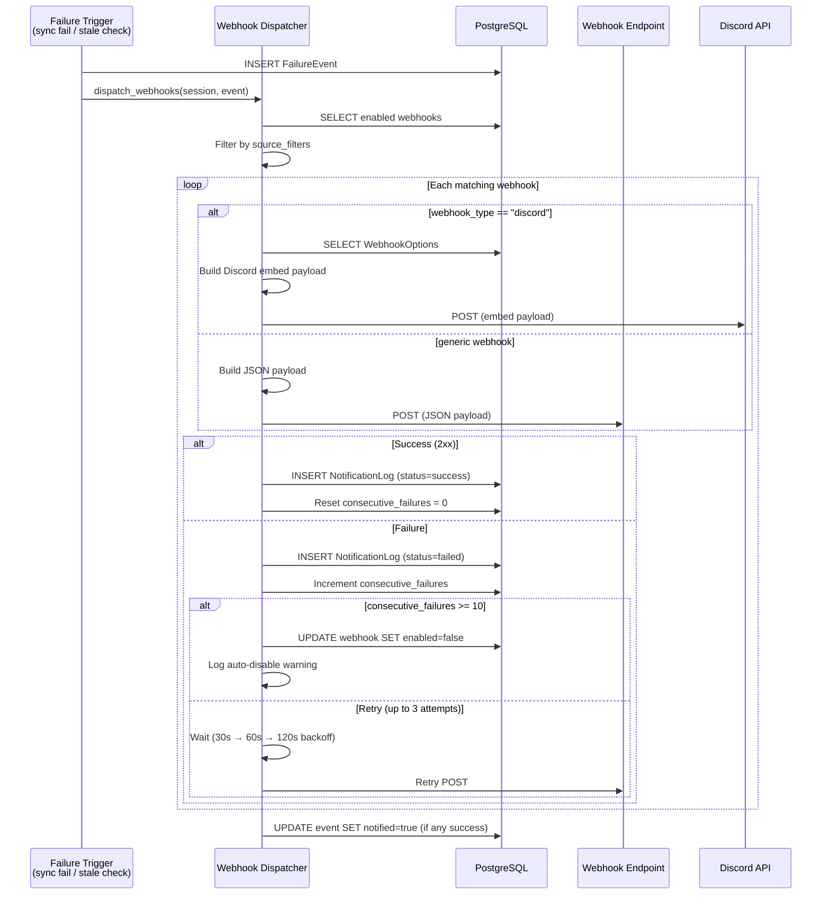
```mermaid
sequenceDiagram
    participant Trigger as Failure Trigger<br/>(sync fail / stale check)
    participant WD as Webhook Dispatcher
    participant DB as PostgreSQL
    participant WH as Webhook Endpoint
    participant Discord as Discord API

    Trigger->>DB: INSERT FailureEvent
    Trigger->>WD: dispatch_webhooks(session, event)
    WD->>DB: SELECT enabled webhooks
    WD->>WD: Filter by source_filters

    loop Each matching webhook
        alt webhook_type == "discord"
            WD->>DB: SELECT WebhookOptions
            WD->>WD: Build Discord embed payload
            WD->>Discord: POST (embed payload)
        else generic webhook
            WD->>WD: Build JSON payload
            WD->>WH: POST (JSON payload)
        end

        alt Success (2xx)
            WD->>DB: INSERT NotificationLog (status=success)
            WD->>DB: Reset consecutive_failures = 0
        else Failure
            WD->>DB: INSERT NotificationLog (status=failed)
            WD->>DB: Increment consecutive_failures

            alt consecutive_failures >= 10
                WD->>DB: UPDATE webhook SET enabled=false
                WD->>WD: Log auto-disable warning
            else Retry (up to 3 attempts)
                WD->>WD: Wait (30s → 60s → 120s backoff)
                WD->>WH: Retry POST
            end
        end
    end

    WD->>DB: UPDATE event SET notified=true (if any success)
```

## Synthetic Monitoring

Self-testing loop that POST/DELETE logs to verify the API is healthy.

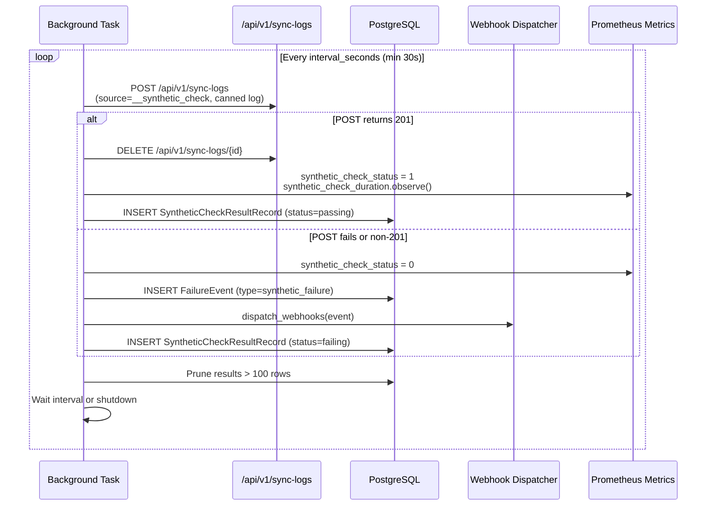
```mermaid
sequenceDiagram
    participant BG as Background Task
    participant API as /api/v1/sync-logs
    participant DB as PostgreSQL
    participant WH as Webhook Dispatcher
    participant M as Prometheus Metrics

    loop Every interval_seconds (min 30s)
        BG->>API: POST /api/v1/sync-logs<br/>(source=__synthetic_check, canned log)

        alt POST returns 201
            BG->>API: DELETE /api/v1/sync-logs/{id}
            BG->>M: synthetic_check_status = 1<br/>synthetic_check_duration.observe()
            BG->>DB: INSERT SyntheticCheckResultRecord (status=passing)
        else POST fails or non-201
            BG->>M: synthetic_check_status = 0
            BG->>DB: INSERT FailureEvent (type=synthetic_failure)
            BG->>WH: dispatch_webhooks(event)
            BG->>DB: INSERT SyntheticCheckResultRecord (status=failing)
        end

        BG->>DB: Prune results > 100 rows
        BG->>BG: Wait interval or shutdown
    end
```

## Health Check (GET /health)

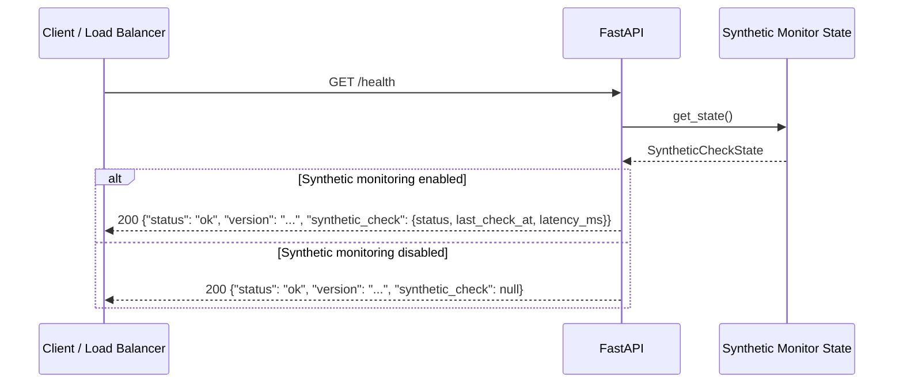
```mermaid
sequenceDiagram
    participant C as Client / Load Balancer
    participant App as FastAPI
    participant SM as Synthetic Monitor State

    C->>App: GET /health
    App->>SM: get_state()
    SM-->>App: SyntheticCheckState

    alt Synthetic monitoring enabled
        App-->>C: 200 {"status": "ok", "version": "...", "synthetic_check": {status, last_check_at, latency_ms}}
    else Synthetic monitoring disabled
        App-->>C: 200 {"status": "ok", "version": "...", "synthetic_check": null}
    end
```

## Version Info (GET /version)

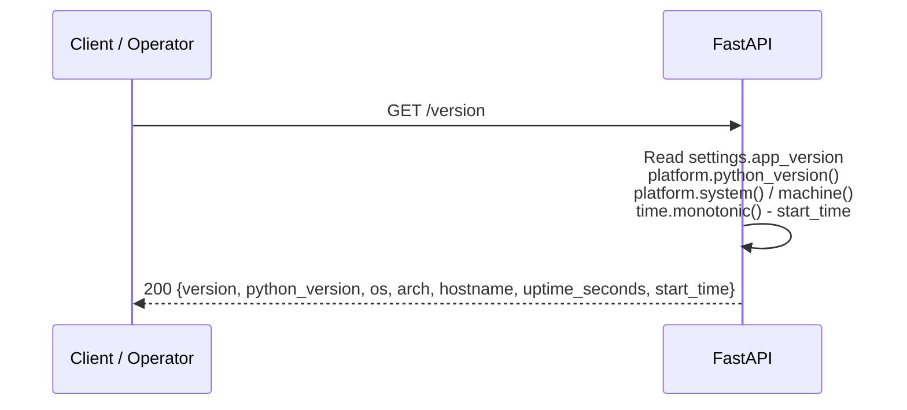
```mermaid
sequenceDiagram
    participant C as Client / Operator
    participant App as FastAPI

    C->>App: GET /version
    App->>App: Read settings.app_version<br/>platform.python_version()<br/>platform.system() / machine()<br/>time.monotonic() - start_time
    App-->>C: 200 {version, python_version, os, arch, hostname, uptime_seconds, start_time}
```

## Prometheus Metrics (GET /metrics)

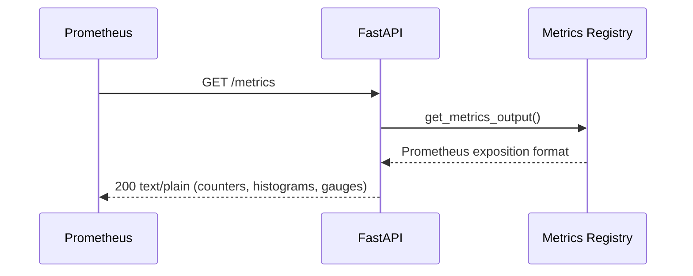
```mermaid
sequenceDiagram
    participant P as Prometheus
    participant App as FastAPI
    participant M as Metrics Registry

    P->>App: GET /metrics
    App->>M: get_metrics_output()
    M-->>App: Prometheus exposition format
    App-->>P: 200 text/plain (counters, histograms, gauges)
```

## Data Retention Cleanup

Background task that purges old sync logs based on retention policy.

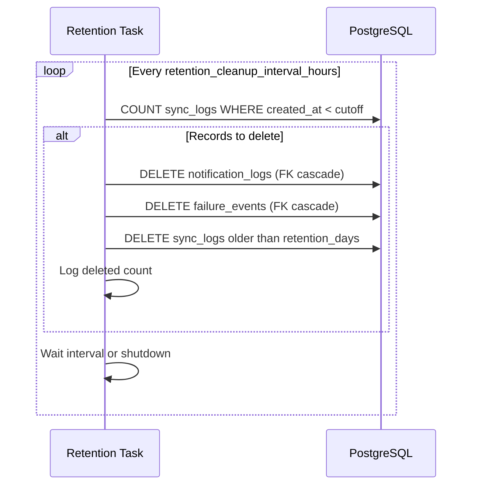
```mermaid
sequenceDiagram
    participant BG as Retention Task
    participant DB as PostgreSQL

    loop Every retention_cleanup_interval_hours
        BG->>DB: COUNT sync_logs WHERE created_at < cutoff
        alt Records to delete
            BG->>DB: DELETE notification_logs (FK cascade)
            BG->>DB: DELETE failure_events (FK cascade)
            BG->>DB: DELETE sync_logs older than retention_days
            BG->>BG: Log deleted count
        end
        BG->>BG: Wait interval or shutdown
    end
```

## Admin User Management

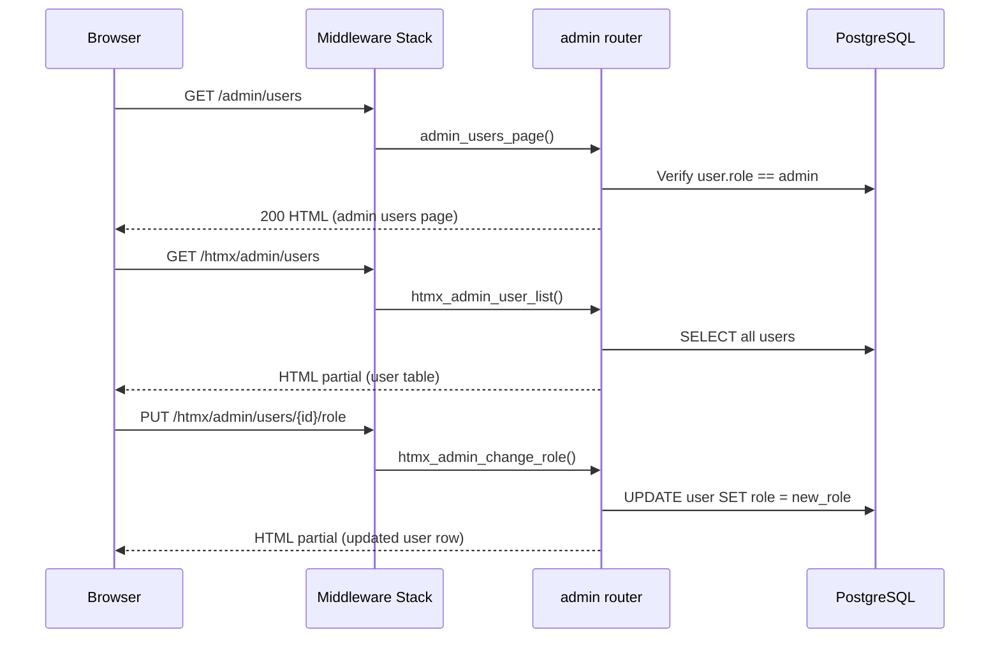
```mermaid
sequenceDiagram
    participant BR as Browser
    participant MW as Middleware Stack
    participant Admin as admin router
    participant DB as PostgreSQL

    BR->>MW: GET /admin/users
    MW->>Admin: admin_users_page()
    Admin->>DB: Verify user.role == admin
    Admin-->>BR: 200 HTML (admin users page)

    BR->>MW: GET /htmx/admin/users
    MW->>Admin: htmx_admin_user_list()
    Admin->>DB: SELECT all users
    Admin-->>BR: HTML partial (user table)

    BR->>MW: PUT /htmx/admin/users/{id}/role
    MW->>Admin: htmx_admin_change_role()
    Admin->>DB: UPDATE user SET role = new_role
    Admin-->>BR: HTML partial (updated user row)
```

## Analytics API (GET /api/v1/analytics/*)

Aggregated statistics, per-source breakdown, and data export.

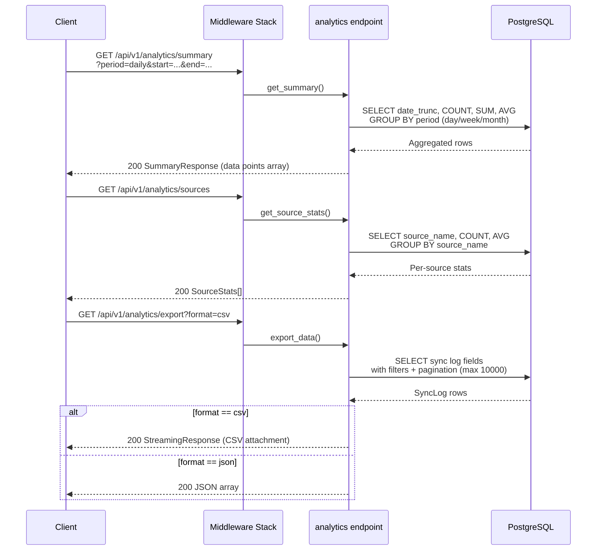
```mermaid
sequenceDiagram
    participant C as Client
    participant MW as Middleware Stack
    participant API as analytics endpoint
    participant DB as PostgreSQL

    C->>MW: GET /api/v1/analytics/summary<br/>?period=daily&start=...&end=...
    MW->>API: get_summary()
    API->>DB: SELECT date_trunc, COUNT, SUM, AVG<br/>GROUP BY period (day/week/month)
    DB-->>API: Aggregated rows
    API-->>C: 200 SummaryResponse (data points array)

    C->>MW: GET /api/v1/analytics/sources
    MW->>API: get_source_stats()
    API->>DB: SELECT source_name, COUNT, AVG<br/>GROUP BY source_name
    DB-->>API: Per-source stats
    API-->>C: 200 SourceStats[]

    C->>MW: GET /api/v1/analytics/export?format=csv
    MW->>API: export_data()
    API->>DB: SELECT sync log fields<br/>with filters + pagination (max 10000)
    DB-->>API: SyncLog rows
    alt format == csv
        API-->>C: 200 StreamingResponse (CSV attachment)
    else format == json
        API-->>C: 200 JSON array
    end
```

## Webhook Management (HTMX)

CRUD operations for webhook endpoints via the settings UI.

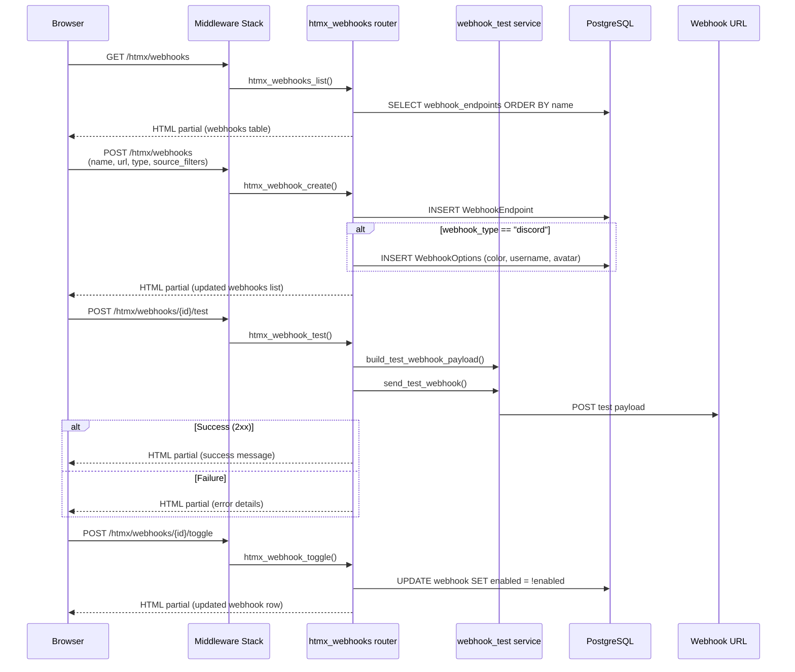
```mermaid
sequenceDiagram
    participant BR as Browser
    participant MW as Middleware Stack
    participant UI as htmx_webhooks router
    participant WS as webhook_test service
    participant DB as PostgreSQL
    participant WH as Webhook URL

    BR->>MW: GET /htmx/webhooks
    MW->>UI: htmx_webhooks_list()
    UI->>DB: SELECT webhook_endpoints ORDER BY name
    UI-->>BR: HTML partial (webhooks table)

    BR->>MW: POST /htmx/webhooks<br/>(name, url, type, source_filters)
    MW->>UI: htmx_webhook_create()
    UI->>DB: INSERT WebhookEndpoint
    alt webhook_type == "discord"
        UI->>DB: INSERT WebhookOptions (color, username, avatar)
    end
    UI-->>BR: HTML partial (updated webhooks list)

    BR->>MW: POST /htmx/webhooks/{id}/test
    MW->>UI: htmx_webhook_test()
    UI->>WS: build_test_webhook_payload()
    UI->>WS: send_test_webhook()
    WS->>WH: POST test payload
    alt Success (2xx)
        UI-->>BR: HTML partial (success message)
    else Failure
        UI-->>BR: HTML partial (error details)
    end

    BR->>MW: POST /htmx/webhooks/{id}/toggle
    MW->>UI: htmx_webhook_toggle()
    UI->>DB: UPDATE webhook SET enabled = !enabled
    UI-->>BR: HTML partial (updated webhook row)
```

## Settings Management (HTMX)

Admin settings for SMTP, OIDC, and synthetic monitoring.

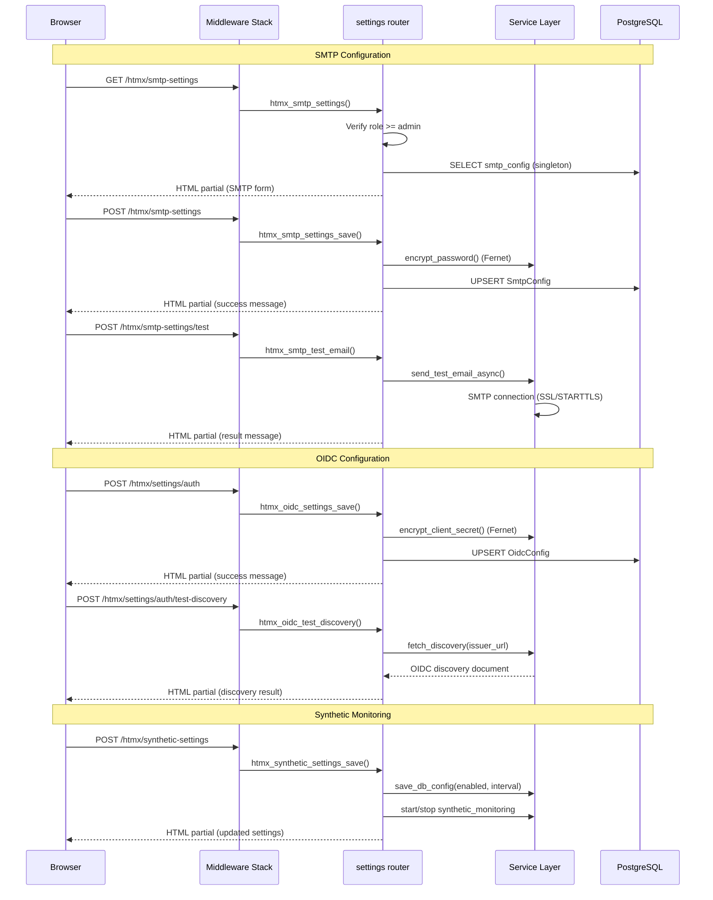
```mermaid
sequenceDiagram
    participant BR as Browser
    participant MW as Middleware Stack
    participant UI as settings router
    participant Svc as Service Layer
    participant DB as PostgreSQL

    Note over BR,DB: SMTP Configuration
    BR->>MW: GET /htmx/smtp-settings
    MW->>UI: htmx_smtp_settings()
    UI->>UI: Verify role >= admin
    UI->>DB: SELECT smtp_config (singleton)
    UI-->>BR: HTML partial (SMTP form)

    BR->>MW: POST /htmx/smtp-settings
    MW->>UI: htmx_smtp_settings_save()
    UI->>Svc: encrypt_password() (Fernet)
    UI->>DB: UPSERT SmtpConfig
    UI-->>BR: HTML partial (success message)

    BR->>MW: POST /htmx/smtp-settings/test
    MW->>UI: htmx_smtp_test_email()
    UI->>Svc: send_test_email_async()
    Svc->>Svc: SMTP connection (SSL/STARTTLS)
    UI-->>BR: HTML partial (result message)

    Note over BR,DB: OIDC Configuration
    BR->>MW: POST /htmx/settings/auth
    MW->>UI: htmx_oidc_settings_save()
    UI->>Svc: encrypt_client_secret() (Fernet)
    UI->>DB: UPSERT OidcConfig
    UI-->>BR: HTML partial (success message)

    BR->>MW: POST /htmx/settings/auth/test-discovery
    MW->>UI: htmx_oidc_test_discovery()
    UI->>Svc: fetch_discovery(issuer_url)
    Svc-->>UI: OIDC discovery document
    UI-->>BR: HTML partial (discovery result)

    Note over BR,DB: Synthetic Monitoring
    BR->>MW: POST /htmx/synthetic-settings
    MW->>UI: htmx_synthetic_settings_save()
    UI->>Svc: save_db_config(enabled, interval)
    UI->>Svc: start/stop synthetic_monitoring
    UI-->>BR: HTML partial (updated settings)
```

## API Authentication (REST)

Token-based authentication for API consumers.

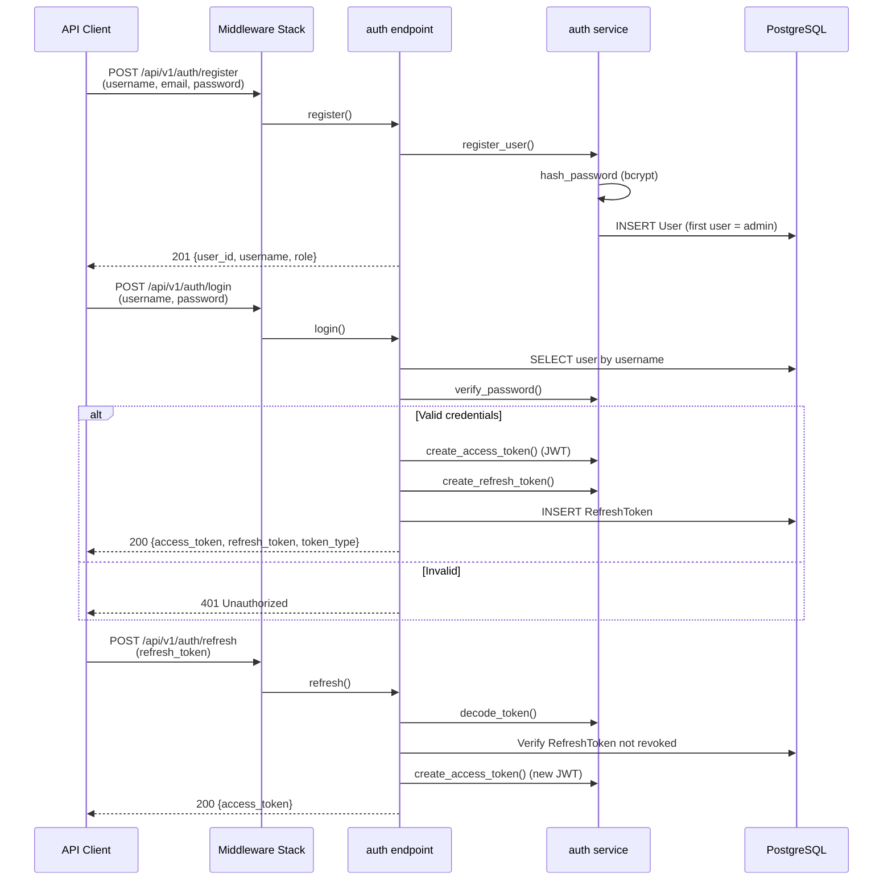
```mermaid
sequenceDiagram
    participant C as API Client
    participant MW as Middleware Stack
    participant API as auth endpoint
    participant Svc as auth service
    participant DB as PostgreSQL

    C->>MW: POST /api/v1/auth/register<br/>(username, email, password)
    MW->>API: register()
    API->>Svc: register_user()
    Svc->>Svc: hash_password (bcrypt)
    Svc->>DB: INSERT User (first user = admin)
    API-->>C: 201 {user_id, username, role}

    C->>MW: POST /api/v1/auth/login<br/>(username, password)
    MW->>API: login()
    API->>DB: SELECT user by username
    API->>Svc: verify_password()
    alt Valid credentials
        API->>Svc: create_access_token() (JWT)
        API->>Svc: create_refresh_token()
        API->>DB: INSERT RefreshToken
        API-->>C: 200 {access_token, refresh_token, token_type}
    else Invalid
        API-->>C: 401 Unauthorized
    end

    C->>MW: POST /api/v1/auth/refresh<br/>(refresh_token)
    MW->>API: refresh()
    API->>Svc: decode_token()
    API->>DB: Verify RefreshToken not revoked
    API->>Svc: create_access_token() (new JWT)
    API-->>C: 200 {access_token}
```

## Stale Source Detection

Triggered during sync log ingestion when a source has a monitor configured.

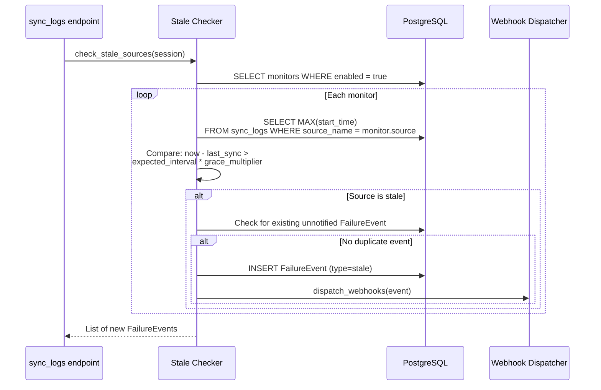
```mermaid
sequenceDiagram
    participant API as sync_logs endpoint
    participant SC as Stale Checker
    participant DB as PostgreSQL
    participant WH as Webhook Dispatcher

    API->>SC: check_stale_sources(session)
    SC->>DB: SELECT monitors WHERE enabled = true
    loop Each monitor
        SC->>DB: SELECT MAX(start_time)<br/>FROM sync_logs WHERE source_name = monitor.source
        SC->>SC: Compare: now - last_sync ><br/>expected_interval * grace_multiplier
        alt Source is stale
            SC->>DB: Check for existing unnotified FailureEvent
            alt No duplicate event
                SC->>DB: INSERT FailureEvent (type=stale)
                SC->>WH: dispatch_webhooks(event)
            end
        end
    end
    SC-->>API: List of new FailureEvents
```

---

*Last updated: 2026-03-15. Generated from codebase analysis. 19 flows documented.*
